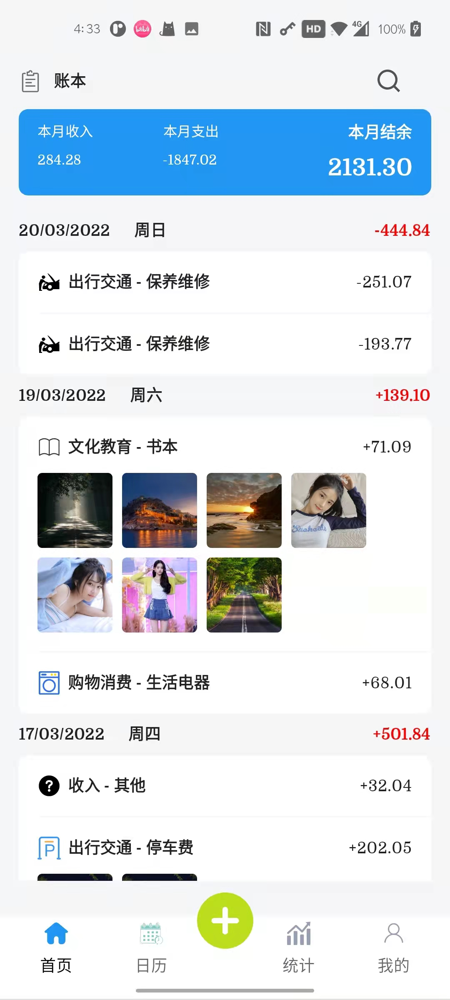
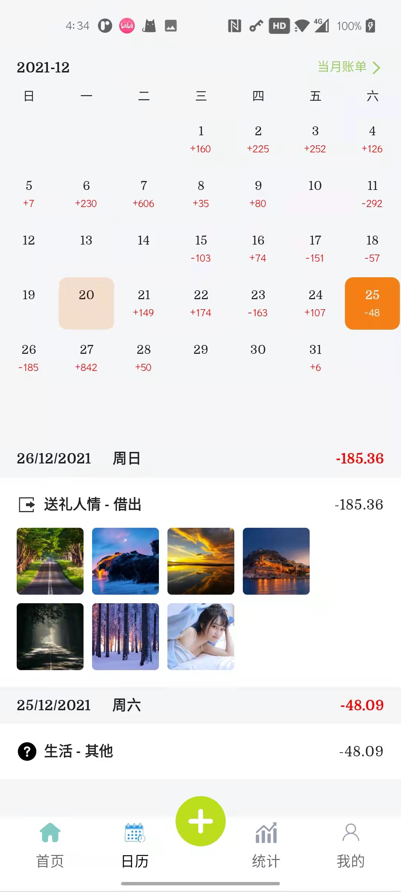
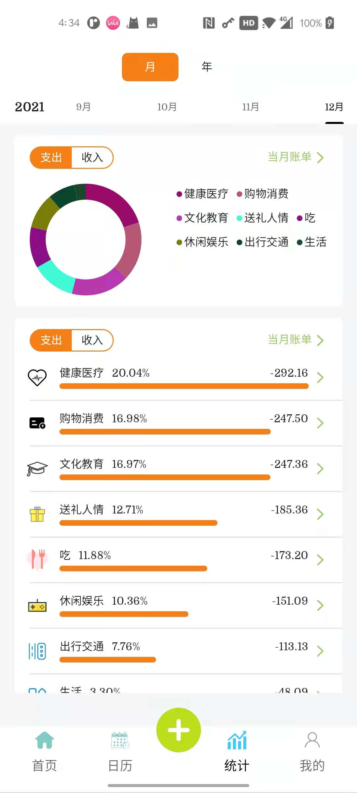
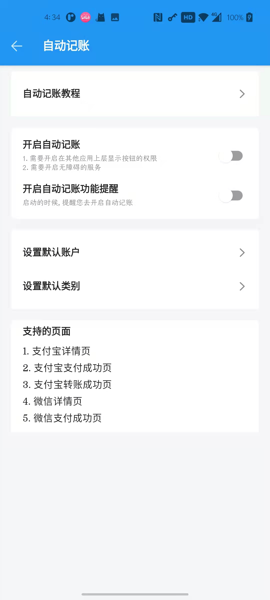
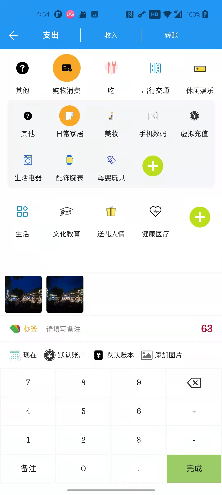

## 更新日志
[changelog](./app-tally/changelog.md)

## 前言

项目实施了组件化. 技术由 [Component](https://github.com/xiaojinzi123/Component) 支持

此 App 是线上运行的一个 App. 扣去了隐私的数据部分. 代码会隔一段时间更新一回. 不会随着线上的版本实时更新. 还望理解!!!

如果你想成为我的记账用户, 也十分欢迎加入我的 QQ 群. 二维码在最后

## 效果图

## 欢迎下载体验

https://github.com/xiaojinzi123/TallyApp/releases

## 运行须知

### Android Studio
需要使用支持 Compose 的 Android Studio
而项目中作者基本会及时更新 as, 并且升级 AGP 插件, 所以基本上 Android Studio 需要是最新的. 还望须知
你电脑上下载一个最新的 Android Studio, 不会影响旧的 Android Studio

### 渠道和功能配置

项目打开之后, 请选择合适的打包渠道和配置

国内请选择: normalKuan 开头的

国外请选择: normalGp 开头的

其他配置随意选择, 不过为了效果, 可以选择带有测试数据的包. 即：包含 HaveTestData

### JDK 配置

由于项目中使用了 Android Compose, 所以需要 JDK 在 11 及其以上. 配置如下

### 启用图片功能
由于图片使用的 Token 是我自己的. 如果你想运行的时候, 图片功能是好使的. 请打开项目根目录的 coreProperties.gradle 文件
将其中的 Gitee 或者 Github 的相关信息替换成自己的 Token 即可

## 技术支持

1. [Component](https://github.com/xiaojinzi123/Component) 组件化框架(非常重要!!!!!)
2. [常用扩展和工具库](https://github.com/xiaojinzi123/AndroidSupport) (有用!)
3. Android Compose
4. Android Jitpack
5. Android Room 数据库
6. Kotlin
7. Kotlin Flow 作为响应式架构的底层支持
8. 图片服务器 Gitee、Github
9. UI灵感来源于各个相关的记账 App

## 须知

记账的签名文件的信息, 填写的都是：123456

